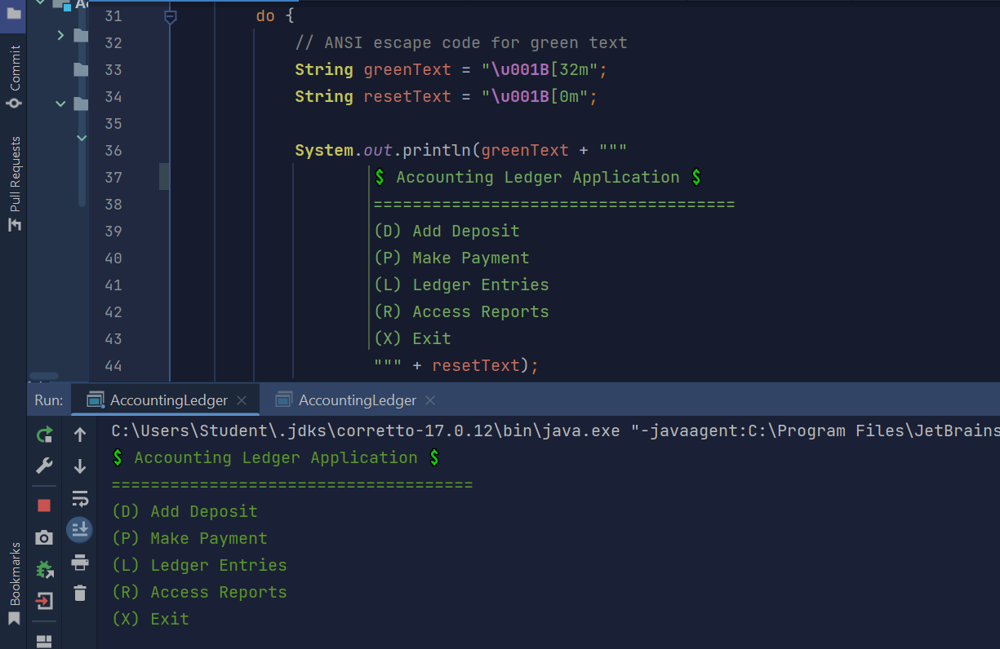
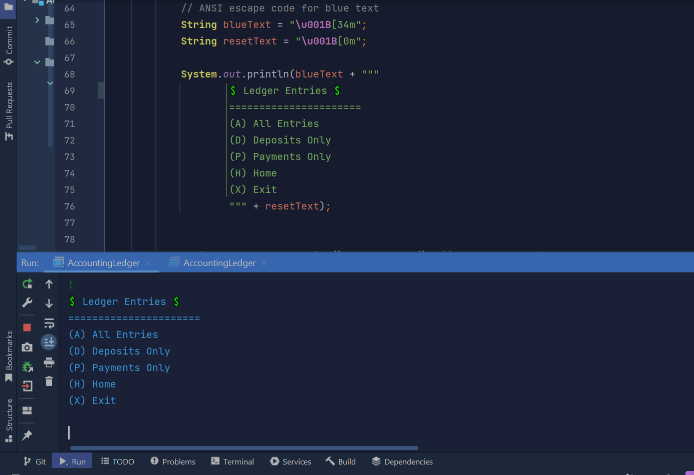
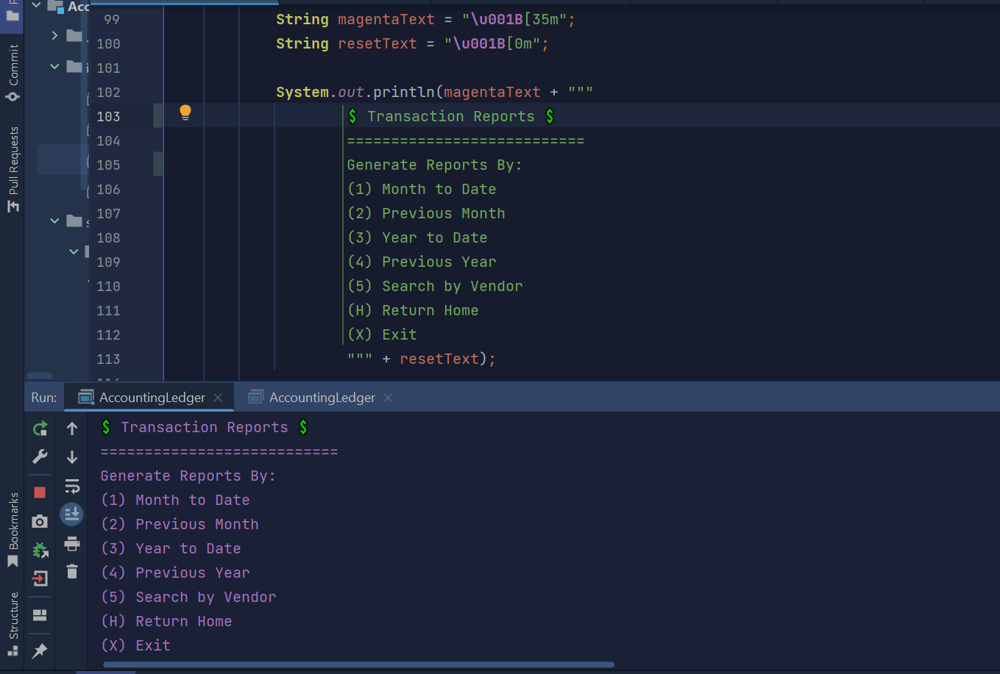

# 💰 Accounting Ledger Application 💲

## Overview

The Accounting Ledger Application is a Java application designed for managing financial transactions. Users can add deposits and payments, view ledger entries, and generate various reports to track their finances efficiently. It demonstrates key programming concepts like file handling, user interaction, and object-oriented design.

## Features

- **Add Deposits**: Record income with a description and vendor.
- **Make Payments**: Log expenses with details about the transaction.
- **View Ledger Entries**: Display all transactions, deposits only, or payments only.
- **Generate Reports**: Access month-to-date, previous month, year-to-date, and previous year reports.
- **Search Transactions**: Find transactions by vendor.

## Structure
The application is structured into four main classes, each serving a specific purpose:

### 1. `Transaction`
This class represents a financial transaction with the following attributes:
- **date**: The date of the transaction (type: `LocalDate`).
- **time**: The time of the transaction (type: `LocalTime`).
- **description**: A brief description of the transaction (type: `String`).
- **vendor**: The vendor associated with the transaction (type: `String`).
- **amount**: The value of the transaction (type: `double`).

**Key Methods:**
- Getters for each attribute.
- `toString()`: Provides a formatted string representation of the transaction.
- `equals()`: Checks if two transactions are the same based on their attributes (to avoid something like duplicate transactions).
- `hashCode()`: Generates a unique identifier for the transaction and helps to efficiently identify an object.

### 2. `FileManager`
This class manages file operations for loading and saving transactions.

**Key Methods:**
- `loadTransactions()`: Reads transactions from a CSV file and returns a list of `Transaction` objects.
- `saveTransaction(Transaction transaction)`: Appends a new transaction to the CSV file each time a transaction object is created.

### 3. `TransactionManager`
This class handles the core logic of the application and user interactions.

**Key Methods:**
- `addDepositPrompt(Scanner scanley)`: Prompts the user for deposit details and adds the deposit to the ledger.
- `addPaymentPrompt(Scanner scanley)`: Prompts the user for payment details and adds the payment to the ledger.
- `displayAllTransactions()`: Displays all recorded transactions.
- `displayDeposits()`: Displays only deposit transactions.
- `displayPayments()`: Displays only payment transactions.
- `Reporting methods`: generate month-to-date and previous month reports.

### 4. `AccountingLedger`
This is the main class of the application, providing the user interface.

**Key Features:**
- Displays a menu with options to add deposits, make payments, view ledger entries, and access reports.
- Handles user input and navigation through the application.
- Keeps running until the user chooses to exi (using a do-while loop).

## Menus

### Home Screen

### Ledger Menu

### Reports Menu

## My FileManager Class 💖

### She does it all.
- I would consider this my interesting piece of code. Last week, I would've been completely intimidated by the sight of the long methods in this class. Now, I can read it and write it just like my BufferReader and BufferWriter.

**Key Methods:**
- **loadTransactions()**: Reads transactions from the specified CSV file, creating `Transaction` objects and adding them to the transaction list.

- **saveTransaction(Transaction transaction)**: Appends a new transaction to the CSV file. Each transaction is formatted and written in a structured way to ensure data consistency.

## What can be improved in the Accounting Ledger Application?

- Refactor code repetition
- Be more specific when prompting user for input
- Account for if the user was in January but wanted to look at the previous month...December.

